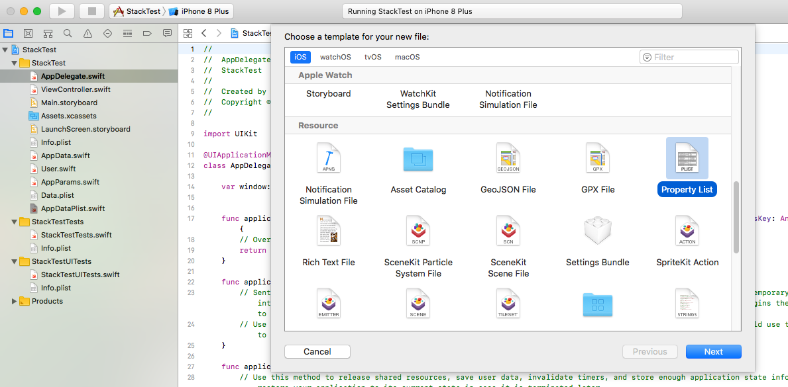
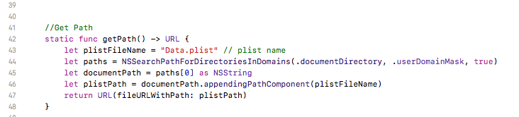

# AppDataPlist
Simple Swift file for store and retrieve data by using .plist file

## Installation

Simply copy and paste AppDataPlist File on your Project :)

## Usage

#### Data Type

Data type should be in Codable. eg:- 

```
   import Foundation

    struct User: Codable {
    
        var name: String
        var email: String
    
    }
```

#### Create .plist file

First you need to create a .plist file 




Change the file name on ``AppDataPlist`` file.




#### Save Data on plist

Use `` AppDataPlist.saveUserInformation(info: <#T##Decodable & Encodable#>, key: <#T##UserData.RawValue#>)`` for save data. eg :-

```
  let myUser = User(name: "Chathuranga",
                          email: "chathu@gmail.com")
  AppDataPlist.saveUserInformation(info: myUser, key: UserData.userInfo.rawValue)

```

#### Retrieve Data on plist

Use `` AppDataPlist.retrieveUserInformation(key: <#T##UserData.RawValue#>, type: <#T##(Decodable & Encodable).Protocol#>)`` for retrieve data. eg :-

```
  AppDataPlist.retrieveUserInformation(key: UserData.userInfo.rawValue, type: User.self)

```


